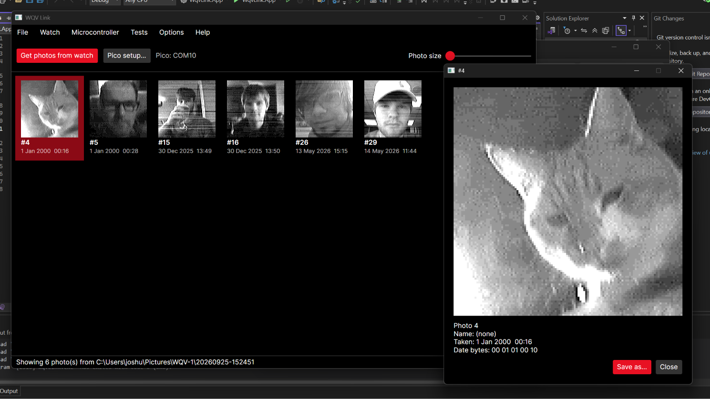
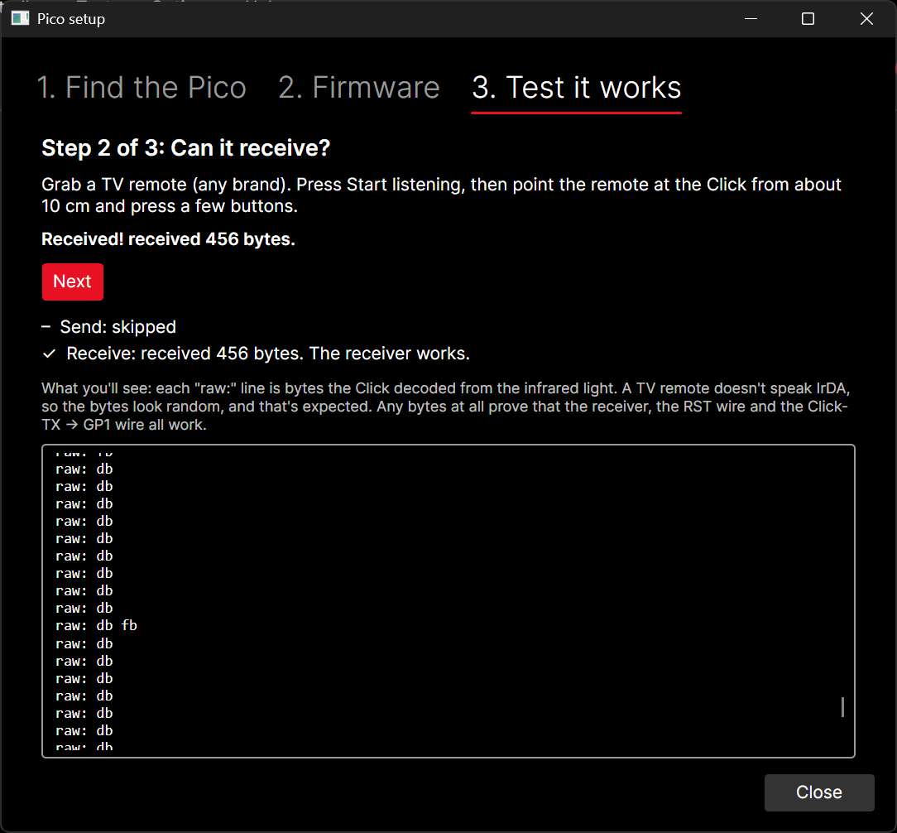
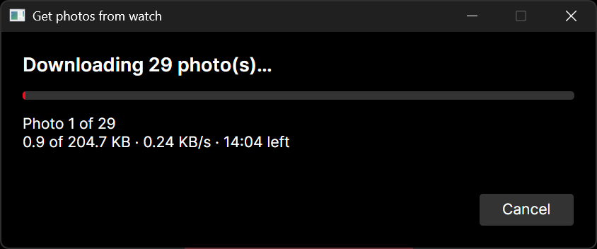

# Open WQV Link

Download the photos from your **Casio WQV-1 wrist camera watch** (2000) to a modern PC, using a DIY approach. No Palm Pilot, no Windows 98, no IrDA dongle.

*An independent, open-source project. It is not Casio's official WQV Link software, and is not affiliated with or endorsed by Casio.*

## Compatibility

| Model | Notes |
|---|---|
| Casio WQV-1 | Fully supported - Verified | 
| Casio WQV-2 | Believed to work without issues, it's the same watch module - Untested |
| Casio WQV-3 | May work in greyscale... Worth a shot - Untested | 
| Casio WQV-10 | I don't think so, however it may work with some tinkering |

## What it does

- Downloads every photo stored on the watch over infrared.
- Saves them as PNG (or BMP), with the date taken and the photo's name stored inside the file.
- Shows them in a gallery you can browse, enlarge and export.
- Sets up the Pico for you: finds it, flashes its firmware, and walks you through a hardware test.
  No Arduino IDE needed for basic use.

## What you need

These are the parts I used, I plan to expand whats compatible, allowing for use of more microcontrollers.

| Part | Notes |
|---|---|
| Casio WQV-1 or 2 | With photos on it, and a battery that isn't low |
| Raspberry Pi Pico (RP2040) | The original Pico. Pico 2 isn't supported yet as I don't have one, I imagine it would be easy to do |
| MikroElektronika **IrDA 3 Click** | The infrared transceiver board (the IrDA 4 Click should also work) |
| 5 jumper wires | check for your usage, female to female if your pico has headers, if breadboarding male to male ect |
| USB cable | Must be a **data** cable, not a charge-only one, must work with your microcontroller |
| A PC | Windows 10/11. macOS and Linux builds* |

*Windows and Linux tested, macOS is untested.

**Prices**
- Raspberry Pi Pico (RP2040) - ~£5
- MikroElektronika IrDA 3 Click - ~£25
- Jumper wires - ~£1-3
- Total should be around £30 

**Note on the 3 Click:** This was the most expensive and hard to source component for me in the UK, if you're skilled, or in different territories, you may be able to get similar for cheaper, or make one yourself if you're an experienced solderer. The bit you want is the "TFDU4101" transceiver. I bought 2 raw and attempted to solder it... I couldn't. If you go down this route, you'll need a microcontroller with an infrared Encoder/Decoder, my original plan was using a QT Py SAMD21, due to having the hardware, if someone wishes to attempt this, I would love to see the result. 

## Quick start

1. **Wire it up**: see [docs/wiring.md](docs/wiring.md). Five wires, should be solder free! The RST wire matters.
2. **Download and run Open WQV Link**: <!-- TODO: link to the Releases page once you publish one -->.
3. **Set up the Pico**: in the app, click **Pico setup...** and go through the three tabs:
   find the Pico, flash the firmware, test it. See [docs/setup.md](docs/setup.md).
4. **Get your photos**: on the watch choose **IR -> COM -> PC**, hold it 5-10 cm from the board, then
   click **Get photos from watch**. See [docs/using-the-app.md](docs/using-the-app.md).

A full download of 29 photos takes about 5 minutes. The watch's infrared is slow (about 0.7 KB/s), I plan on optimising this heavily.

## Documentation

| Guide | What's in it |
|---|---|
| [Wiring](docs/wiring.md) | Connecting your microcontroller to the IrDA 3 Click |
| [Setting up the Pico](docs/setup.md) | Finding the port, flashing, the hardware test |
| [Using the app](docs/using-the-app.md) | Downloading, the gallery, exporting, options |
| [Troubleshooting](docs/troubleshooting.md) | What to check when something doesn't work |
| [Command line](docs/cli.md) | The `wqvlink` command-line tool |
| [How it works](docs/how-it-works.md) | The protocol and image format, for the curious |
| [Building from source](docs/building.md) | For developers |

## Screenshots

| Gallery | Pico setup | Downloading |
|---|---|---|
|  |  |  |

## Credits

- **Marcus Gröber** documented the WQV-1 infrared protocol:
  <https://www.mgroeber.de/wqvprot.html>
- **Kees Jongenburger** - WQV-2 notes:
  <https://wqv-wristcam.sourceforge.net/protocol/protocol.html>
- <!-- TODO: anyone else you'd like to thank -->

## Licence

MIT: see [LICENSE](LICENSE). This covers the code, the documentation and the images in this repository.
Third-party components and their licences are listed in [THIRD-PARTY-NOTICES.md](THIRD-PARTY-NOTICES.md).

Casio and WQV are trademarks of Casio Computer Co., Ltd., used here only to describe the watches this
project works with.

<!-- TODO: optional sections: project story/blog link, "why I built this", contributing. -->
