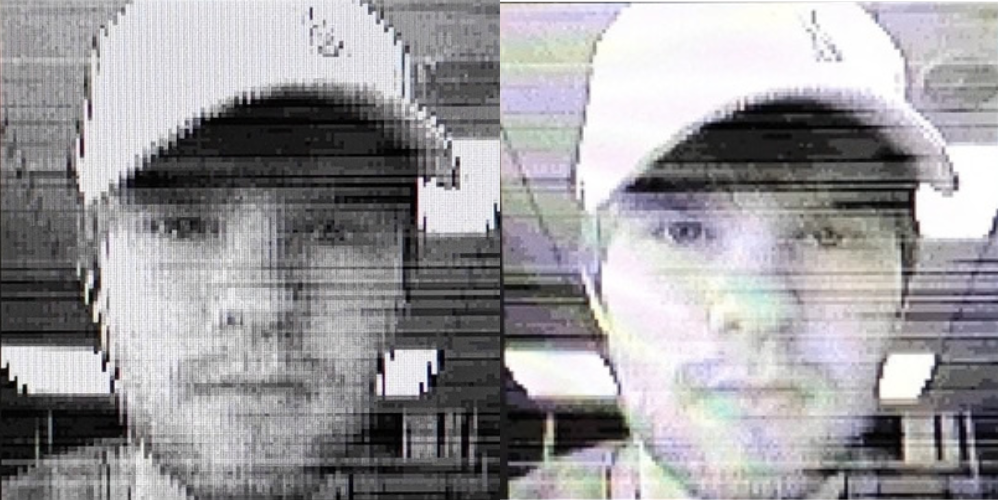

# How it works

For the curious. You don't need any of this to use Open WQV Link.

## Into story
Hi! Im Josh! I love a bit of old tech! 

I picked up a broken WQV-1 watch of Marketplace for around £20... Bargain... Especially as the only thing wrong with it was the battery! 

After a while and some TLC, it was a highlight of my collection! I love the old Sony Cyber-shots, so a Y2K wrist camera was golden! 

A month or 2 in, I wanted the photos off the watch... I thought it would be using a cable... boy was i wrong. 

Anyways! for the past 6 months I have been researching the watch protocols, IrDA as a medium, and possible ways to get photos off the watch, without the need for expensive old school hardware / adapters! 

I originally tried a paper feed sensor from an Epson printer... then a medical grade IrDA adapter + Serial to USB adapter... both to no avail. Then the attempt at soldering a TFDU4101, they were smaller than expected. 

I even bought a Palm PDA! Trying the generic way! I forgot I needed a cradle or IrDA system to install the software to talk to the watch on it! 

Anyhow! After going over budget multiple times, as all personal projects do... Here we are! A working demo... With the hope of building it out to be the ultimate modern guide to extracting photos from such cool, old-school Casios!

## The hardware chain

```
[WQV-1 watch] ~~infrared~~ [IrDA 3 Click] --serial 115200--> [Pi Pico] --USB--> [PC: Open WQV Link]
```

The **Pico is unfortunately... a dumb pipe.** Its firmware (`firmware/wqv_bridge`) copies every byte from USB to the Click and back. All of the protocol logic runs on the PC.

The Click's MCP2122 chip converts between normal serial data and IrDA-style infrared pulses. Its crystal fixes the speed at **115200 baud**.

## The protocol

The watch speaks a simplified form of IrDA's link layer (IrLAP). Marcus Gröber
[documented it](https://www.mgroeber.de/wqvprot.html). Shoutout to him, however a couple of details were corrected by testing on a real watch (I have marked them with a '#').

### Frames

Every message looks like this:

```
C0 | address | control | data... | checksum (2 bytes) | C1
```

- `C0` starts a frame and `C1` ends it.
- The **checksum** is simply the sum of the address, control and data bytes, keeping the low 16 bits.
- Any `C0`, `C1` or `7D` inside the frame is **escaped** as `7D` followed by the byte XOR `20`, so it can't be mistaken for a start or end marker.

Example, the PC's "hello": `C0 FF B3 01 B2 C1`.

### Connecting

| Direction | Message | Meaning |
|---|---|---|
| PC -> watch | `FF B3` | Hello (repeated every 200 ms until answered) |
| watch -> PC | `FF A3` + 4 bytes | Here I am, and my clock (hh mm ss 1/256 s) |
| PC -> watch | `FF 93` + those 4 bytes + `02` | Let's talk! Use address 02 |
| watch -> PC | `02 63` | OK |
| PC -> watch | `02 11` | Ready? |
| watch -> PC | `02 01` | Ready |

### Downloading

The PC asks for all images, and the watch replies with a header: record size `1C3D` (7229 bytes) and
the **number of photos** (#). Then the PC requests the data one packet at a time. Each packet carries
**128 bytes**.

The control bytes carry rolling sequence numbers (`31, 51, 71, ... F1, 11` out; `42, 44, ... 4E, 40` back).
If a packet is lost, the PC asks again with the same number, so nothing is duplicated.

At about 180 ms per packet, that's roughly **0.7 KB/s**: 29 photos take about 5 minutes (give or take)

## The image format

Each photo is a **7229-byte record**:

| Bytes | Contents |
|---|---|
| 0-23 | Name (text, padded with spaces or zeros) |
| 24-28 | Year - 2000, month, day, **hour, minute** (#) (Gröber's page has these two swapped, and based on other photos from the day, I believe this is the correct way around) |
| 29-7228 | 120 x 120 pixels, two per byte, 16 shades of grey |

In each pixel byte, the **low half is the left pixel** (#). Value 0 is white and 15 is black.


*Gröber's page doesn't specify the nibble order... so the left image uses high-nibble-first, the right low-nibble-first (which is correct) which matches Kees Jongenburger's WQV-2 notes.*

## Saving

Open WQV Link writes the PNG files itself, with no imaging libraries. It stores the name and date as PNG text
and as EXIF (Make "CASIO", Model "WQV-1", DateTimeOriginal), so photo apps show the date taken.
