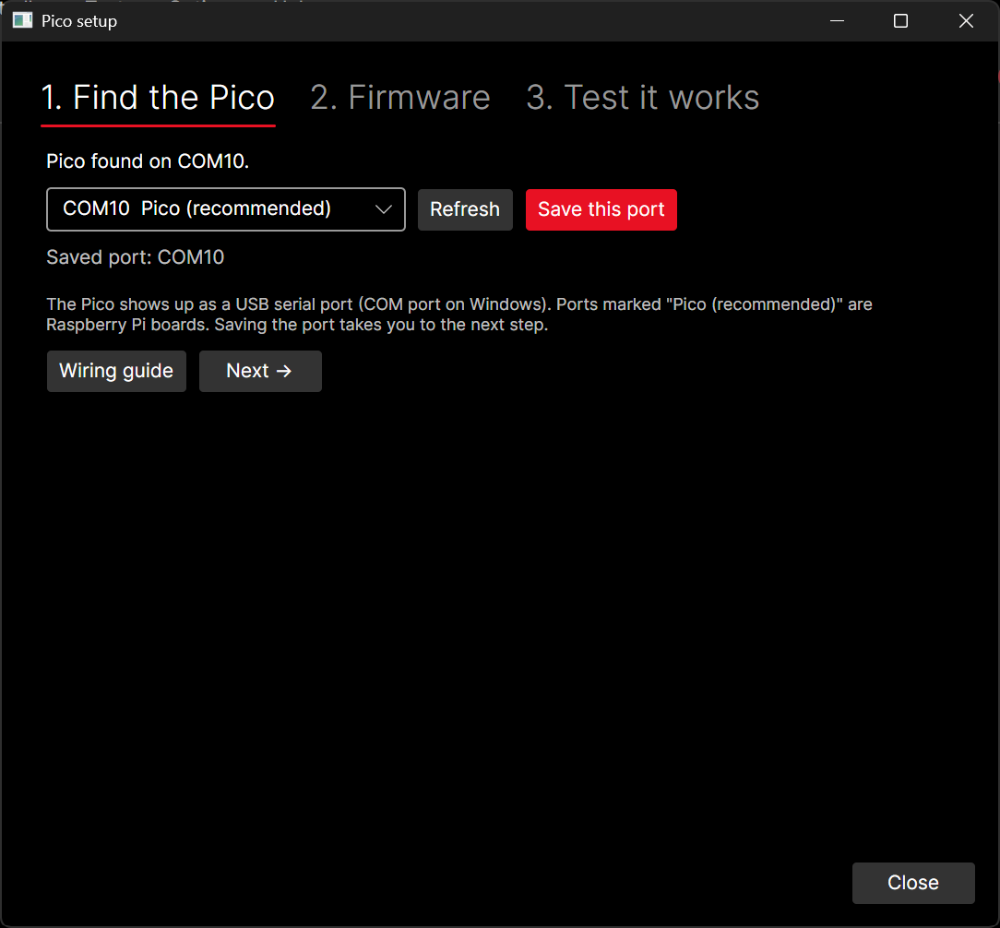
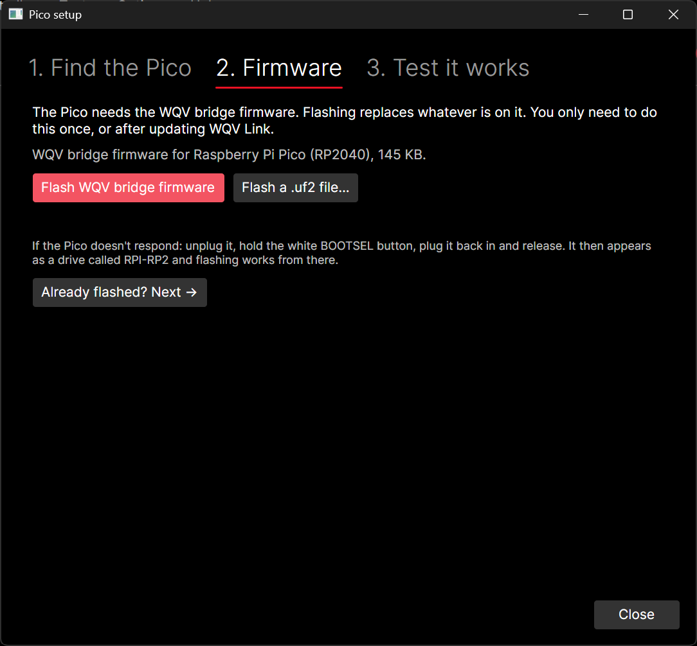
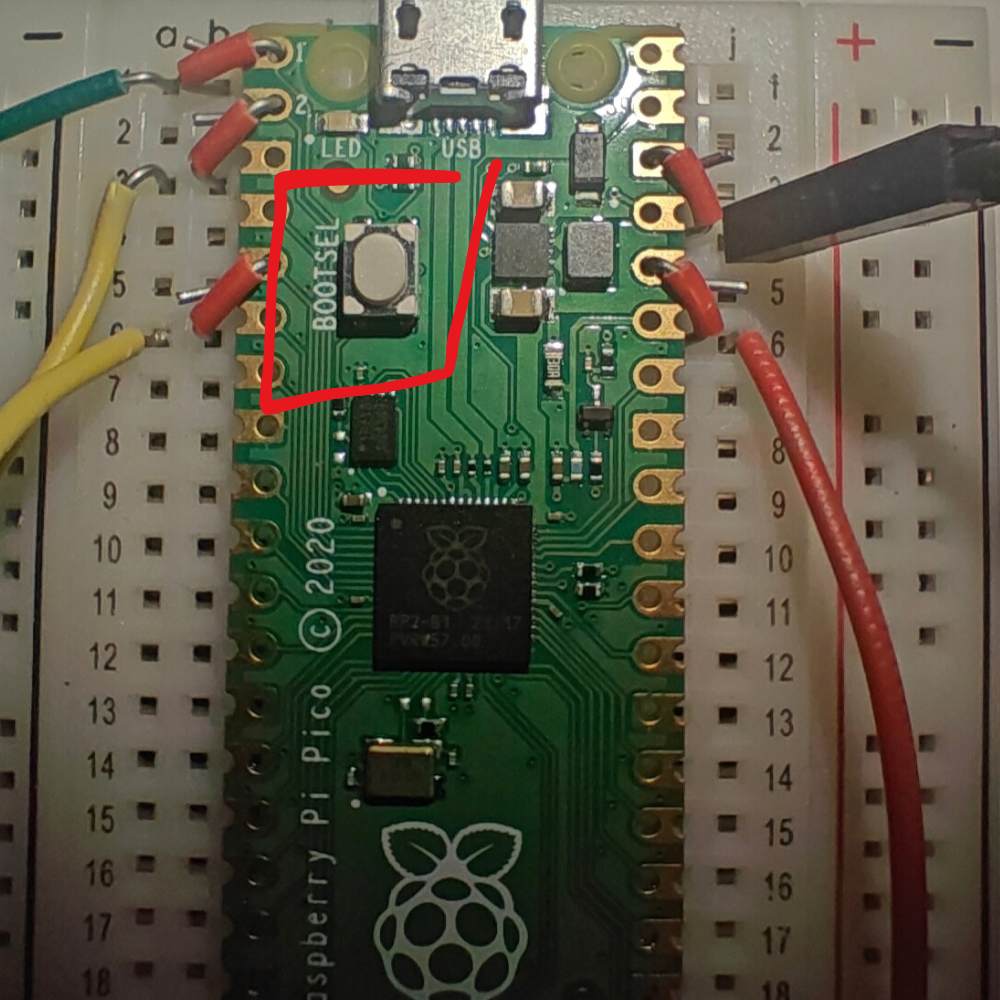
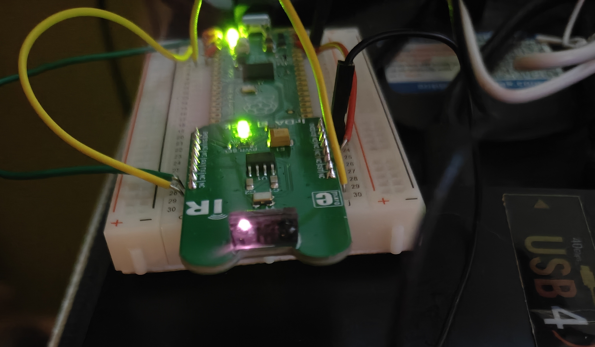

# Setting up the Microcontroller

Open WQV Link sets up the Microcontroller* for you. Plug it in, open the app and click **Pico setup...**. The window has
three tabs. Go through them in order.

*Currently only the pico is supported

## 1. Find the Pico

The Pico shows up as a USB serial port (a **COM port** on Windows). Ports marked **Pico (recommended)**
are Raspberry Pi boards. Pick yours and click **Save this port** so the app remembers it.

**No Pico listed?**
- Try another USB cable. Many cables are charge-only and carry no data.
- A brand-new Pico with nothing on it may not show a port at all. Go to tab 2 and use the BOOTSEL method (2.b).

## 2. Firmware

The Pico needs the **WQV bridge** firmware, a small program that passes bytes between USB and the
infrared board. The app includes it: click **Flash WQV bridge firmware**, confirm, and wait about
10-20 seconds. The app saves the port the Pico comes back on.

You only need to do this once, or after updating Open WQV Link.

**2.b: If flashing can't start the Pico**
1. Unplug the Pico.
2. Hold down the white **BOOTSEL** button.
3. Plug it back in, then let go.
4. The Pico appears as a drive called **RPI-RP2**. Click **Flash** again.

## 3. Test it works

Click **Test**. The app walks you through:

1. **Can it send?** Point your phone's camera at the Click and click **Start sending**. The infrared LED
   flashes for 10 seconds. It's hard to see it with your eyes (I could see brief red flickering), but the camera shows a large purple flicker.
   I found using the **front (selfie) camera** to do a much better job due to some back cameras having IR filters.
2. **Can it receive?** Click **Start listening** and press buttons on any TV remote pointed at the Click.
   Lines of `raw:` bytes appear. They look random because a TV remote doesn't speak IrDA, and that's
   expected: any bytes at all prove the receiver works. No TV remote? Try another IR launcher! Most remotes, some phones have IR systems.
3. **Can it talk to the watch?** (optional) Put the watch in **IR -> COM -> PC** and click **Ping watch**.

When the receive test passes, click **Finish**. You're ready to [get your photos](using-the-app.md).

