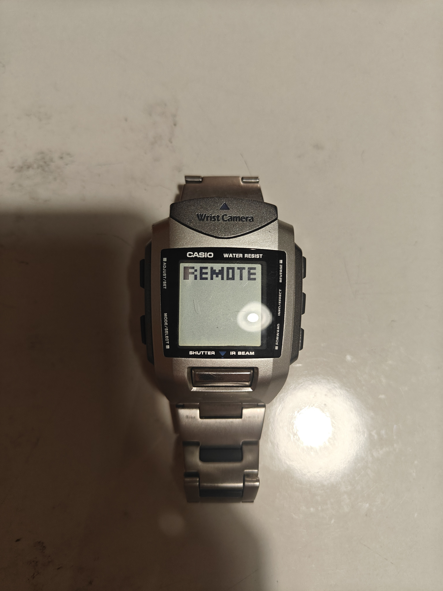
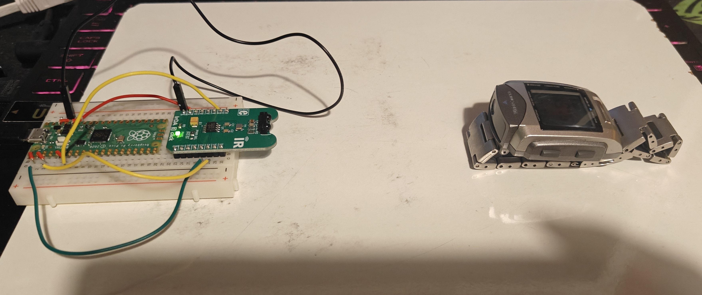
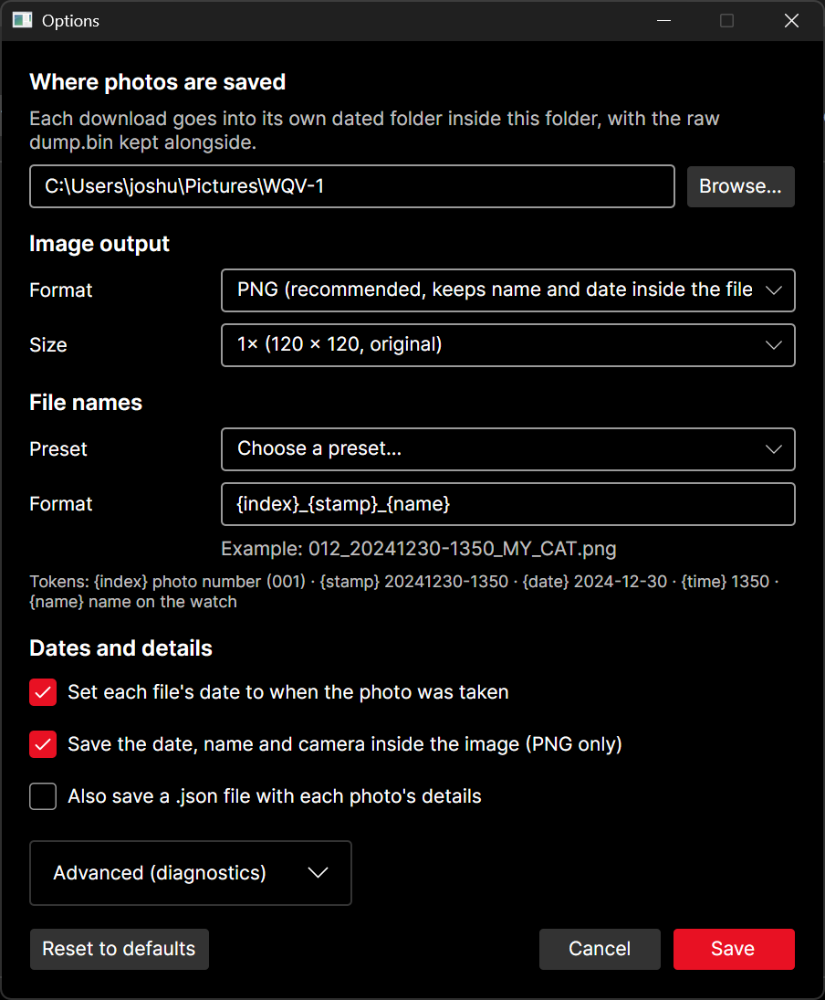

# Using the app


## Getting photos from the watch

1. Click **Get photos from watch** (or press **Ctrl+D**). A window explains how to get the watch ready.
2. On the watch:
   1. Press **MODE** until the display shows **IR**.
   2. Select **COM**, then **PC**, it should then display **Remote**, this means it's on standby.
   
3. Hold the watch **5-10 cm** from the Click, with the two infrared windows facing each other. Resting both
   on a table helps.
   
4. Click **Start** and keep the watch still.

The app waits for the watch to answer, then downloads every photo. It can take a while depending on your system and wiring.


When it finishes, the new photos appear in the gallery.

> The watch leaves COM mode after about 2 minutes of waiting, so click **Start** soon after selecting PC. Once the connection starts, it wont leave COM until completed.

## Where photos are saved

Each download gets its own folder:

```
Pictures\WQV-1\20260925-181502\
    001_20251219-2043_untitled.png
    002_20251219-2043_untitled.png
    003_...
    dump.bin      <- the raw data from the watch (keep it: it can be decoded again with this software any time)
    session.log   <- a byte-by-byte record of the transfer, for troubleshooting
```

**File -> Open photos folder** takes you there. You can change the location in **Options**. It defaults to your Pictures folder (Pictures\WQV-1)

## The gallery

- **Photo size** slider: make thumbnails bigger or smaller.
- **Double-click** a photo to see it large, with its name, date and raw date bytes. **Save as...**
  is a shortcut to save another copy of the selected one anywhere you want. 
- **Ctrl+click** or **Shift+click** to select several, then **File -> Export selected...**, same but for multiple.
- **File -> Export all...** saves every photo to a folder you choose, using your current options.
- **File -> Open photos (dump.bin)...** opens any earlier download.

## Options

**Options -> Settings...** (Ctrl+,)

| Setting | What it does |
|---|---|
| Where photos are saved | The folder each download's own dated folder goes into |
| Format | PNG (recommended: keeps the name and date inside the file) or BMP |
| Size | 1x is the watch's real 120 x 120 pixels. 2x, 4x and 8x enlarge with sharp pixels |
| File names | A preset, or your own pattern using `{index}` `{stamp}` `{date}` `{time}` `{name}` |
| Set each file's date... | File Explorer and photo apps then sort by when the photo was *taken* |
| Save the date, name and camera inside the image | Photo apps show "Casio WQV-1" and the date taken |
| Also save a .json file | A small text file per photo with its details |



## Tests menu

The **Tests** menu runs single hardware checks (loopback, blast, echo, sniff, ping). Most people only
need the guided test in [Pico setup](setup.md#3-test-it-works). See
[Troubleshooting](troubleshooting.md) for when to use each.
