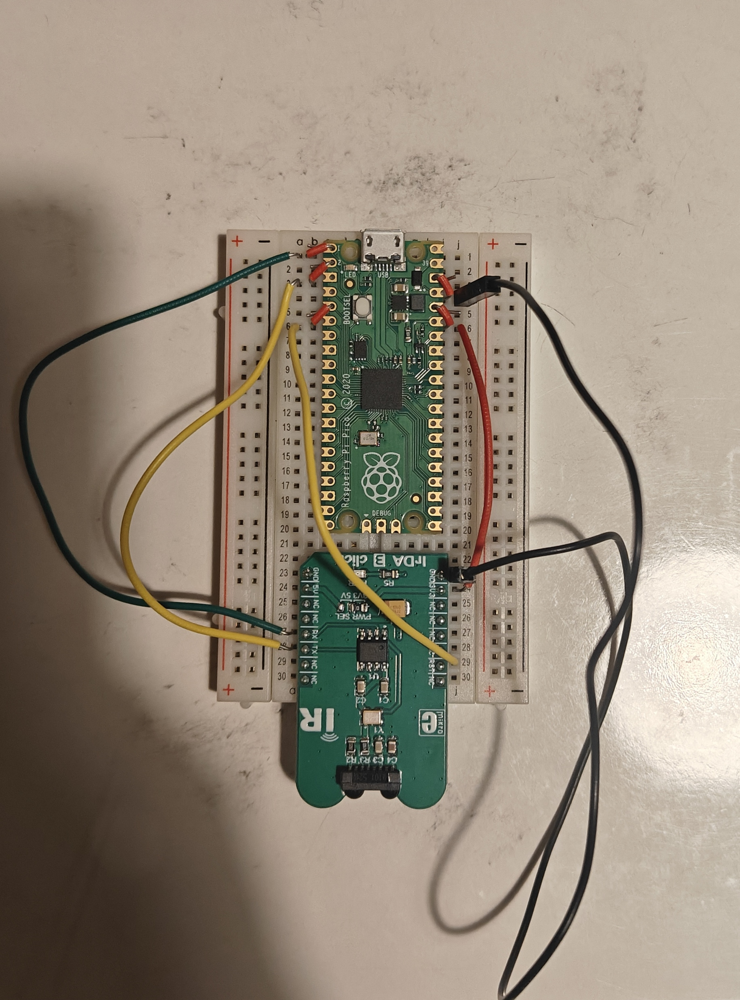
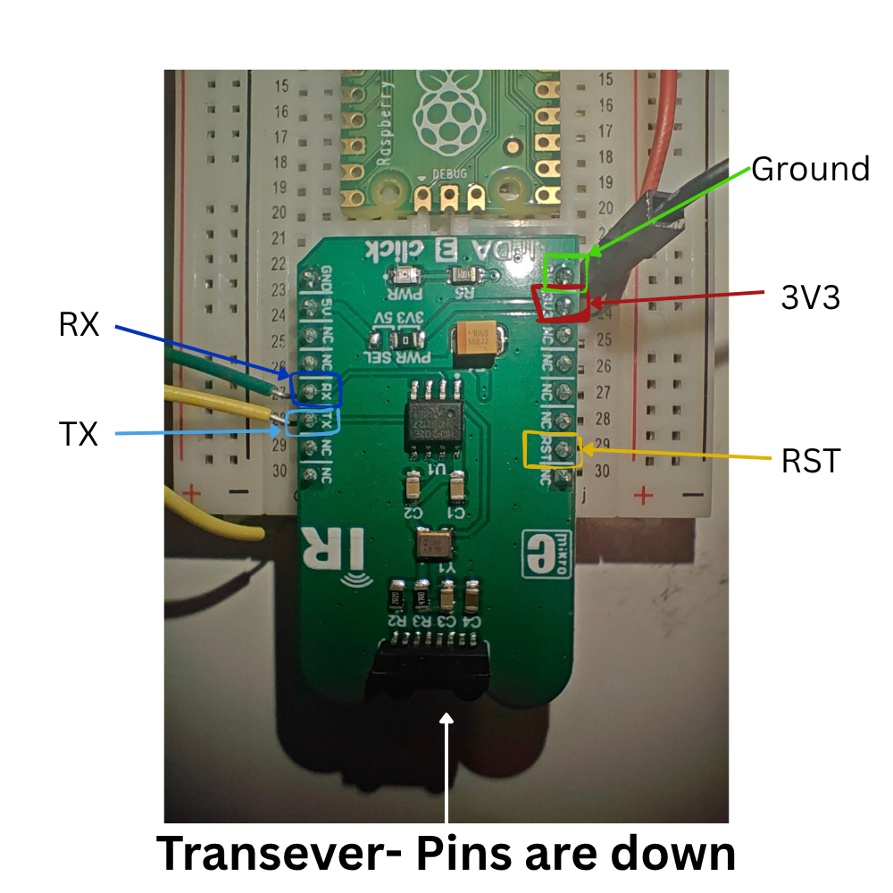
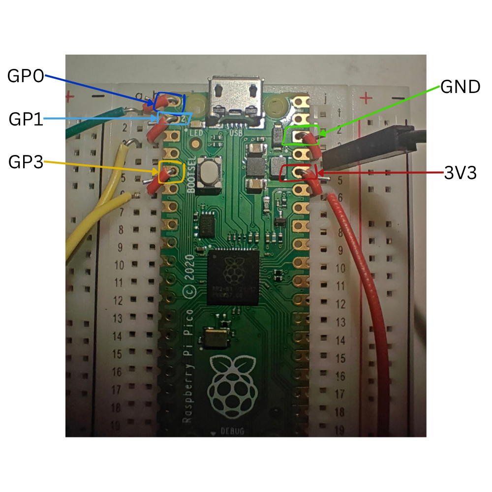
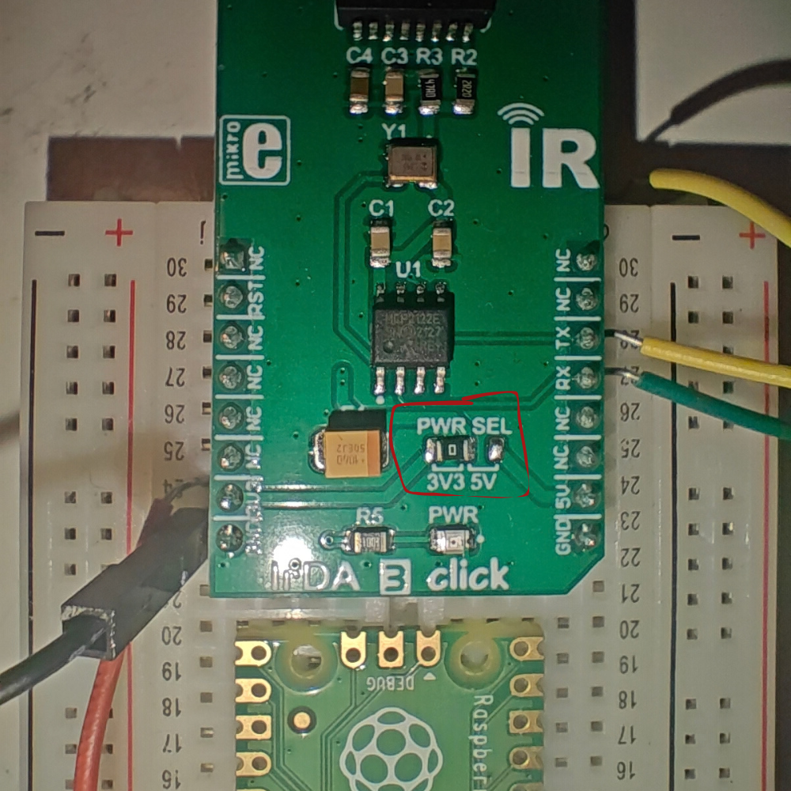

# Wiring

You connect a Raspberry Pi Pico to a MikroElektronika **IrDA 3 Click** with five wires. The Pico talks to
the PC over USB and to the Click over a serial link. The Click turns that serial data into infrared.



Here is my example... as you can tell, I am by no means a professional. Luckily for you, assuming you have headers on your pi pico... It should be a lot easier. 

## Connections

| Pico (physical pin) | Click label | What it's for |
|---|---|---|
| GP0, pin 1 | **RX** | Pico sends -> Click receives |
| GP1, pin 2 | **TX** | Click sends -> Pico receives |
| GP3, pin 5 | **RST** | Keeps the Click running |
| 3V3(OUT), pin 36 | **3V3** | Power |
| GND, pin 38 | **GND** | Ground |

**TX and RX cross over.** The Pico's transmit pin goes to the Click's *receive* pin, and vice versa.

If you have issues, check that **RST** is getting power, this was an issue for me, I also found wiring it directly to **3V3** also works fine.




Here are two colour-coded images of which pins to wire where, I use a breadboard as my pico doesn't have headers, however as long as the pins are connected, it doesn't matter how it's done!

## Pin diagram

```
                      Pico (USB at top)
                   +------[USB]------+
  Click RX <- GP0  | 1            40 | VBUS
  Click TX -> GP1  | 2            39 | VSYS
               GND | 3            38 | GND       -> Click GND
               GP2 | 4            37 | 3V3_EN
 Click RST <- GP3  | 5            36 | 3V3(OUT)  -> Click 3V3
                   |       ...       |
                   +-----------------+
```

## Jumper JP1

Set **JP1** on the Click to **3V3**. The Pico uses 3.3 V logic. I believe this is the default setting it arrives with.



## The RST wire matters

If RST is low, the Click is held in reset and **nothing works**: it neither sends nor receives. The
firmware drives GP3 high after start-up. If you'd rather not use GP3, tie RST straight to 3V3.

With a multimeter, you should see about **3.3 V between RST and GND** while the Pico is powered.

This bug cost me an evening... I should've checked my wiring sooner.

## Tips!

My number 1 tip it check connections with a multimeter, I used the continuity setting a lot checking my wires were pressed up against the contects of each, making sure it was all working.

## Checklist

- [ ] GP0 -> Click RX
- [ ] GP1 -> Click TX
- [ ] GP3 -> Click RST (or RST tied to 3V3)
- [ ] 3V3(OUT) -> Click 3V3
- [ ] GND -> Click GND
- [ ] JP1 on 3V3

Next: [Setting up the Pico](setup.md).
